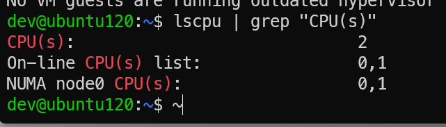
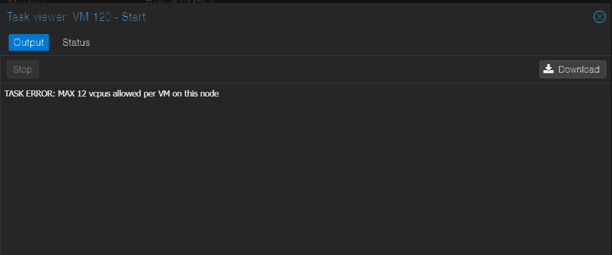

# KN01
This is a screenshot of the specs of my host:

VM specs when the VM has a smaller core count than the host:

In the console: 

when overallocating Cpus I get the following error:

This is probably to protect users from overallocating. However there are ways of getting KVM to emulate additional cores.

here you see a screenshot of when the memory is smaller than the hosts memmory:

When attempting to start the vm with 256gb of Ram, it also fails to boot. I get the following error:

IMO this is also a protective mesure, you could also emulate more ram using the harddisk as ram. but its probably better to do that inside the VM.