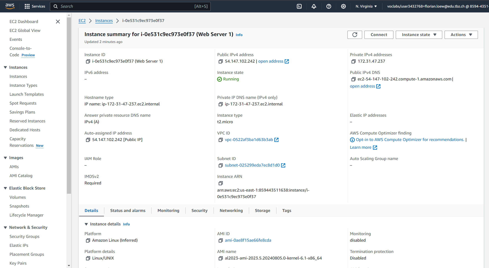
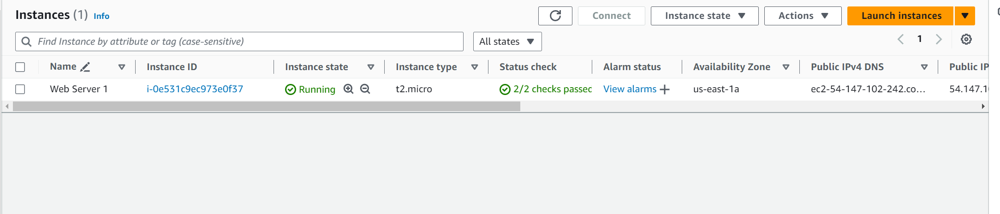
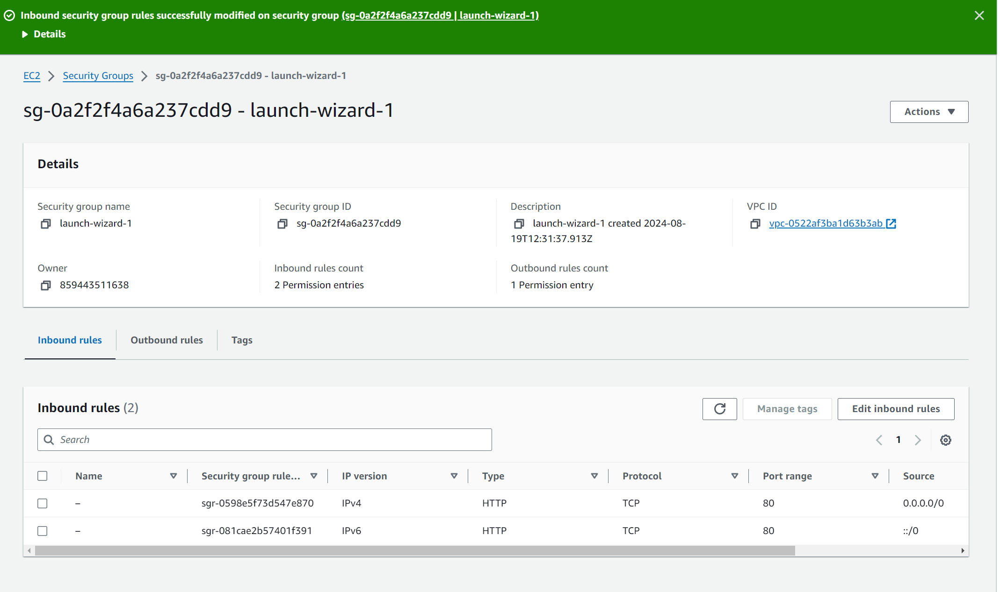

Here you can see my ES2 instance running and added to the inbound rules:

This is my instance's summery page:

Here is the list of my es2 instances:

here's a list of my security groups and inbound rules at the bottom:
