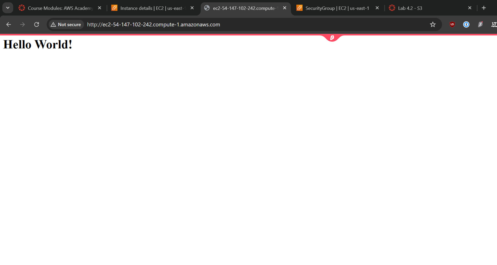
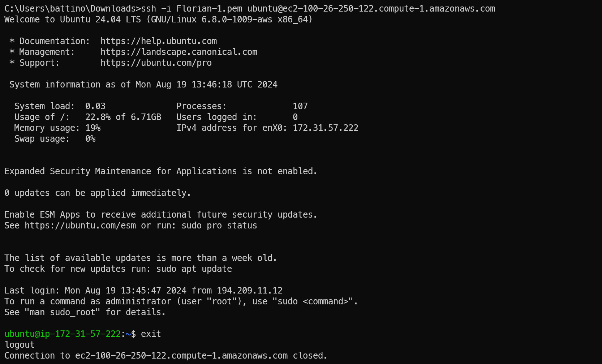

# KN02
## A
### a
Here you can see my ES2 instance running and added to the inbound rules:

This is my instance's summery page:

Here is the list of my es2 instances:

here's a list of my security groups and inbound rules at the bottom:

### b
List of Objects in the Bucket:

List of Buckets:

Staticly hosted Site:

Config to make the Bucket have Static website hosting:

Permission policy Json to give me public access:

## B
Here you can see how i can connect via an SSH key:

Here is proof, that using a non-registered public key doesnt grant access.

This shows how the SSH key is configured
