# A
Netzwerk diagram:
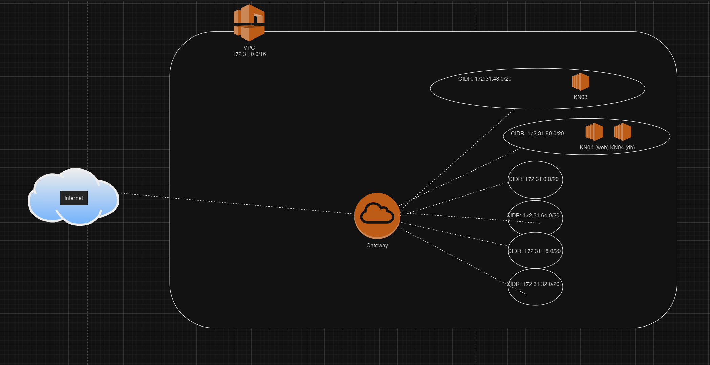
# B
Die beiden Subnets
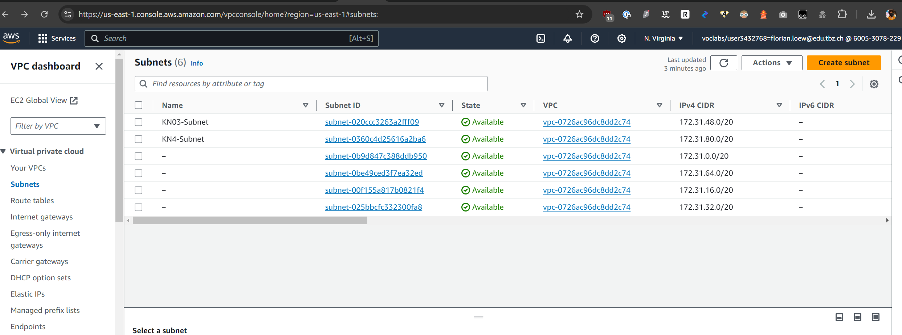

IP für DB:
172.31.80.10

IP für den Webserver:
172.31.80.20

# C

## Sicherheitsgruppe

Liste:
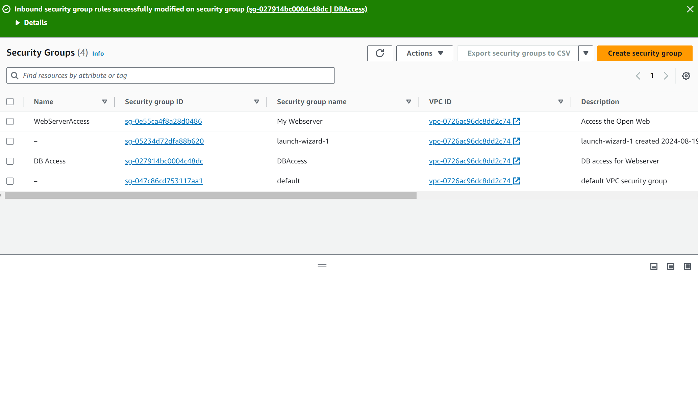

DB:
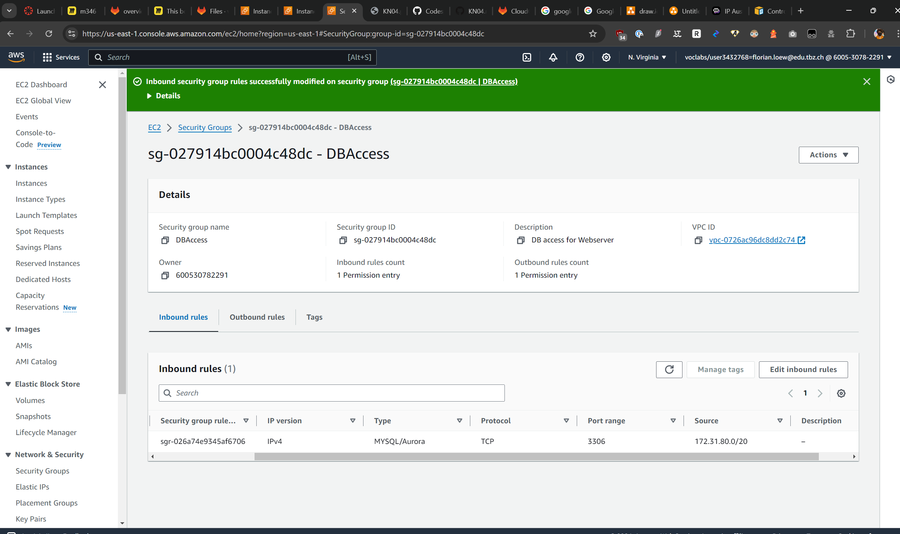

WEB:
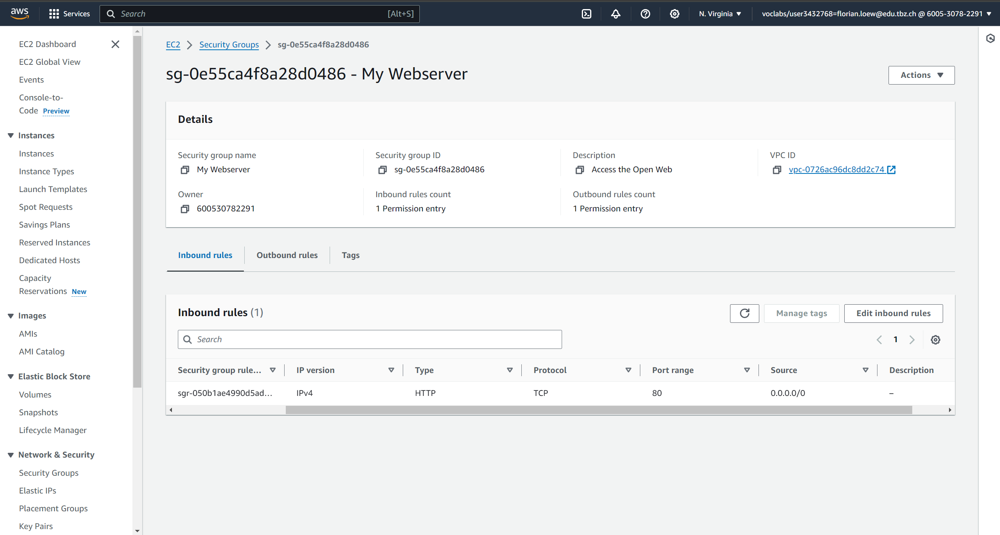

## Öffentliche, statische IPs

IP:
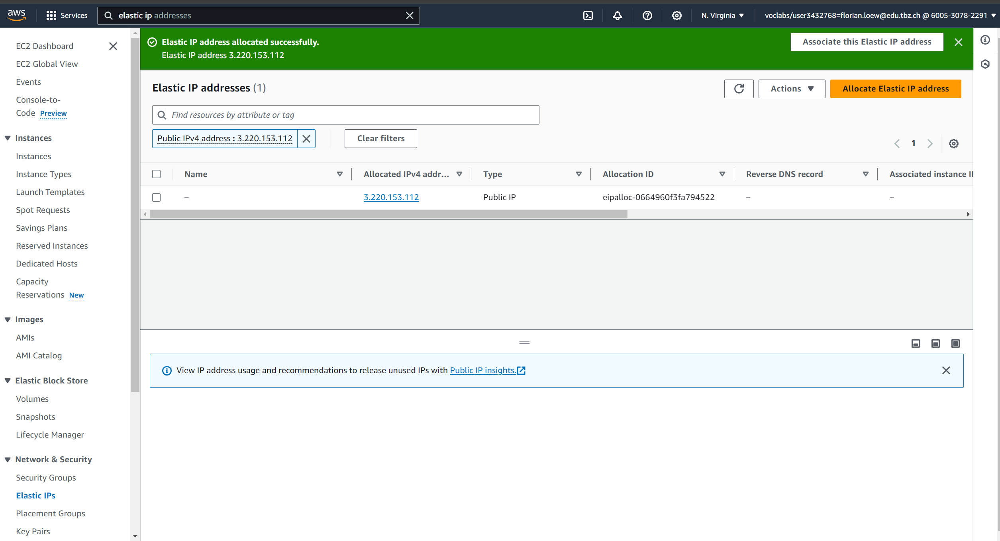

Show stopped Instances with static IP:
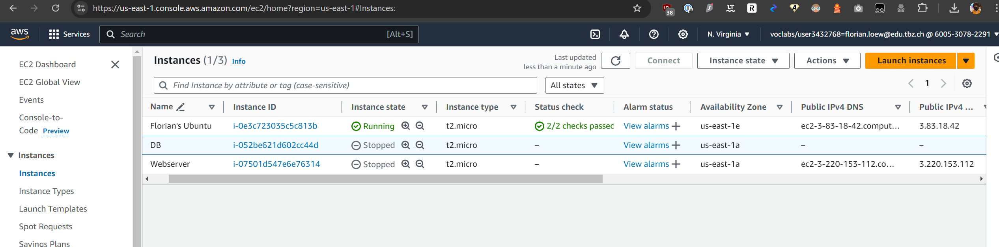

DB Server with Subnetid visibile:
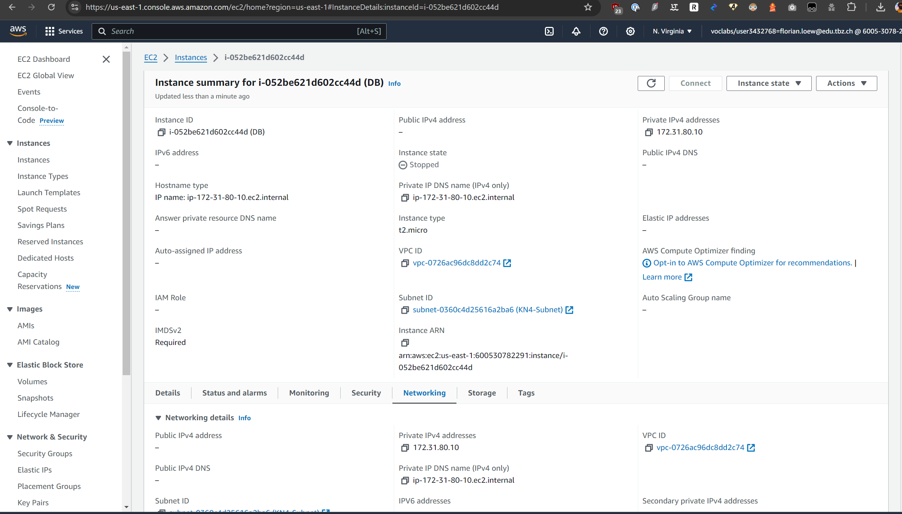

Webserver with Subnet id visible:
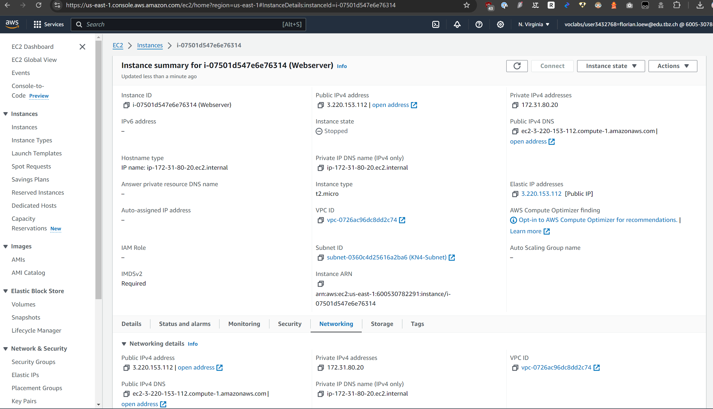

Proof of working pages:
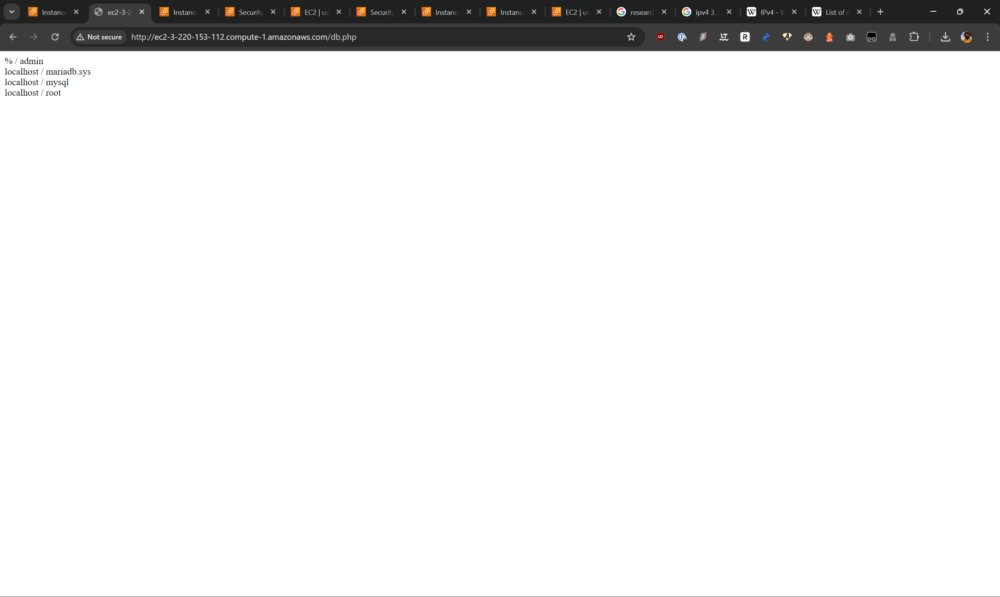

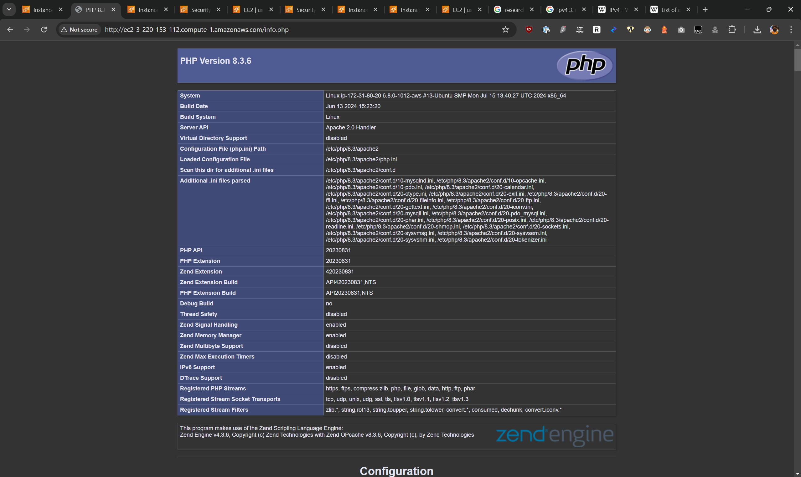

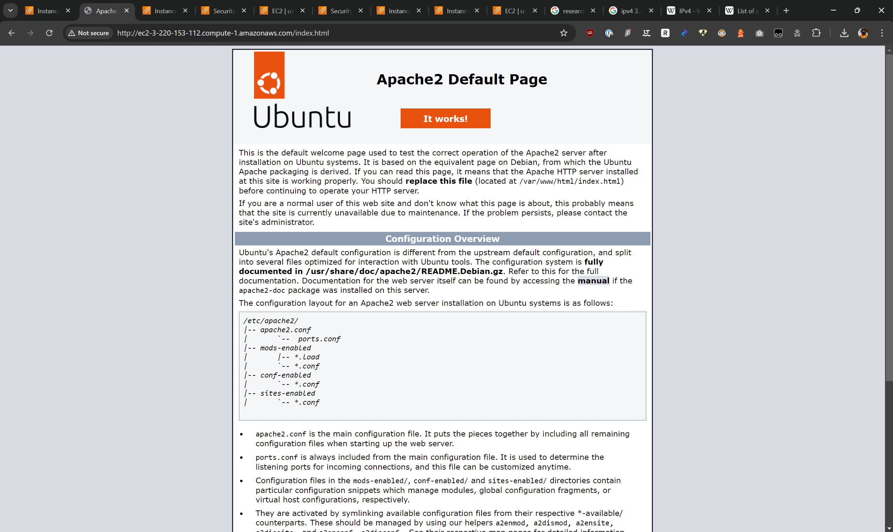