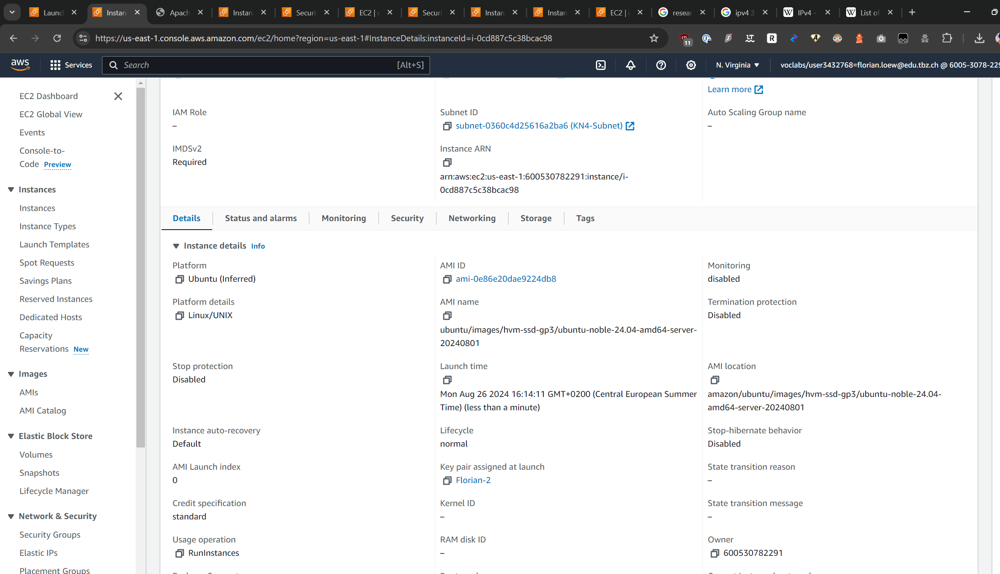
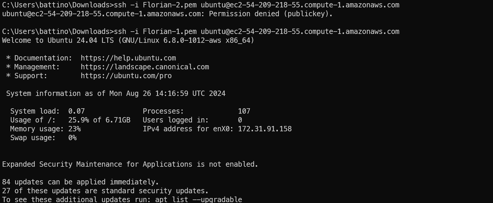
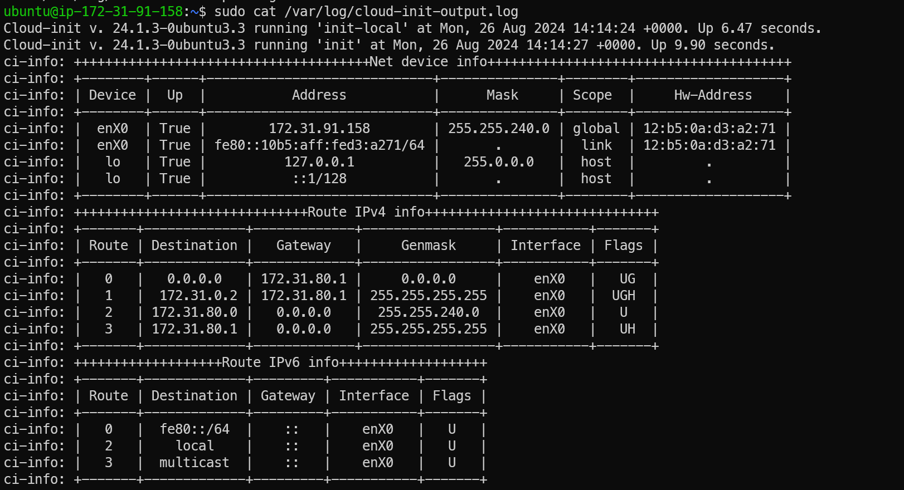
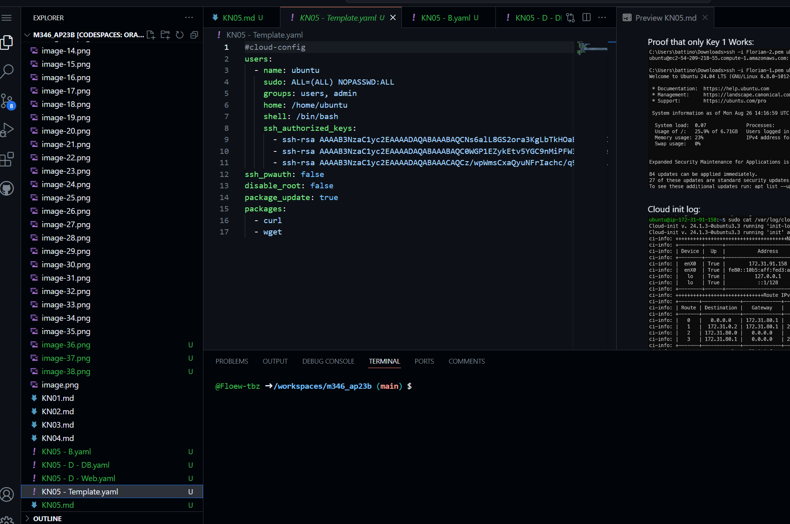
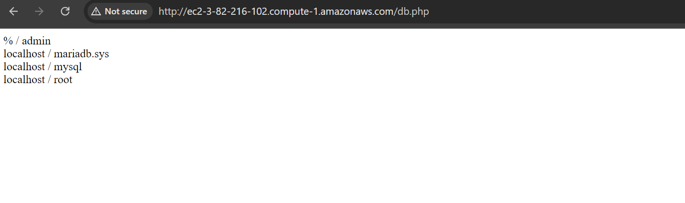
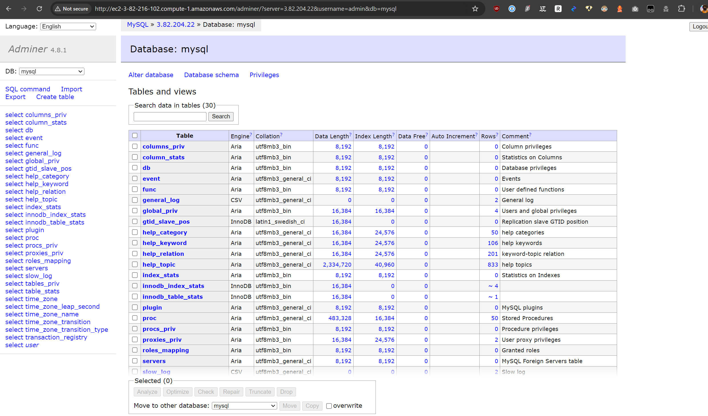
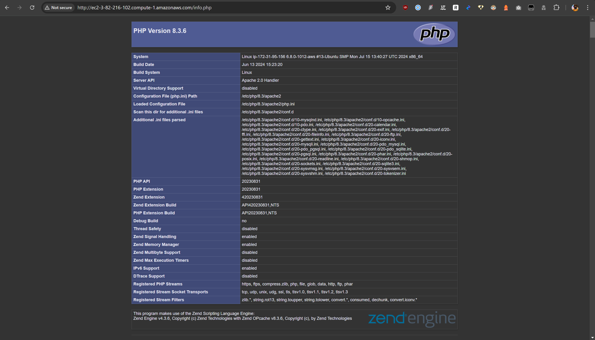
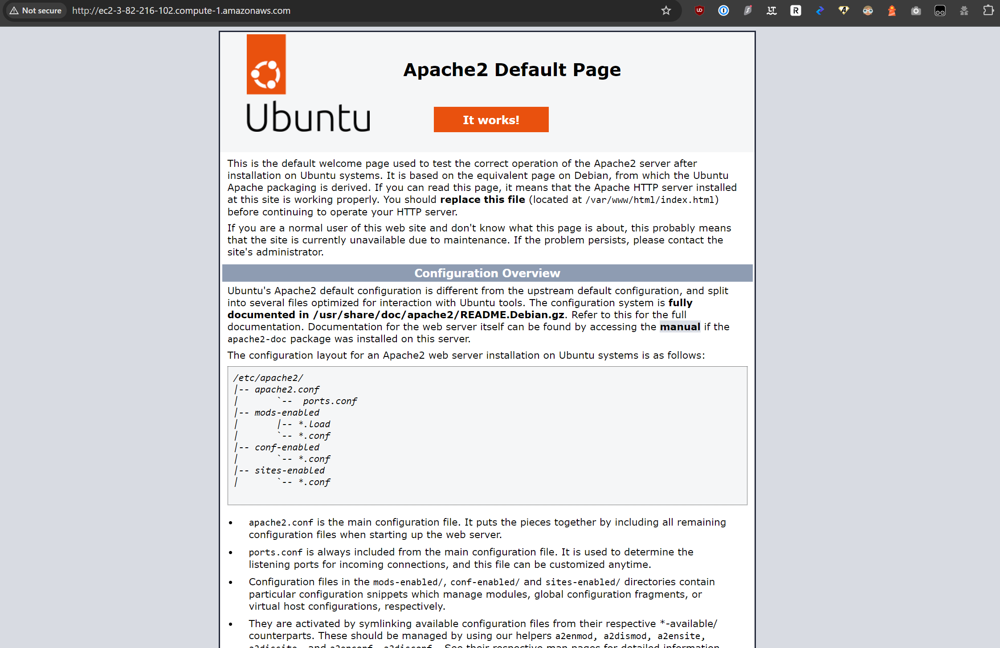

# A
Yaml file with explainations:
```yaml
#cloud-config
# This header specifies that the file is a cloud-init configuration file.

users:
  - name: ubuntu
    # Create a user named 'ubuntu'.
    sudo: ALL=(ALL) NOPASSWD:ALL
    # Allow the 'ubuntu' user to execute any command as any user without a password.
    groups: users, admin
    # Add 'ubuntu' to the 'users' and 'admin' groups.
    home: /home/ubuntu
    # Specify the home directory for the 'ubuntu' user.
    shell: /bin/bash
    # Set the default shell to bash for the 'ubuntu' user.
    ssh_authorized_keys:
      - ssh-rsa AAAAB3NzaC1yc2EAAAADAQABAAABAQC0WGP1EZykEtv5YGC9nMiPFW3U3DmZNzKFO5nEu6uozEHh4jLZzPNHSrfFTuQ2GnRDSt+XbOtTLdcj26+iPNiFoFha42aCIzYjt6V8Z+SQ9pzF4jPPzxwXfDdkEWylgoNnZ+4MG1lNFqa8aO7F62tX0Yj5khjC0Bs7Mb2cHLx1XZaxJV6qSaulDuBbLYe8QUZXkMc7wmob3PM0kflfolR3LE7LResIHWa4j4FL6r5cQmFlDU2BDPpKMFMGUfRSFiUtaWBNXFOWHQBC2+uKmuMPYP4vJC9sBgqMvPN/X2KyemqdMvdKXnCfrzadHuSSJYEzD64Cve5Zl9yVvY4AqyBD aws-key
    # Add an SSH public key for the 'ubuntu' user to enable key-based authentication.

ssh_pwauth: false
# Disable password authentication for SSH, allowing only key-based access.

disable_root: false
# Allow root login (though not recommended for security reasons).

package_update: true
# Update the package list to ensure the latest versions are available.

packages:
  - curl
  - wget
# Install 'curl' and 'wget' packages.
```

# B

Angepaste Cloud init datei:

```yaml
#cloud-config
users:
  - name: ubuntu
    sudo: ALL=(ALL) NOPASSWD:ALL
    groups: users, admin
    home: /home/ubuntu
    shell: /bin/bash
    ssh_authorized_keys:
      - ssh-rsa AAAAB3NzaC1yc2EAAAADAQABAAABAQCNs6alL8GS2ora3KgLbTkHOaBcsxJMHO9MCuPfHC4W1DejDzfjVD2M61k6afnhNN6HLkkxFMPuxWxleujELK0XxIX97oqasBoBtLOvwpvQlNAmjj5RwyKpaH6JT8DpCrifbdCHkZiGpC3M+lcf960VCcdy+AnTw1CQu0mc53OqasQVVC9+DfAtHq8wqHqnm94BafYmvEof4ZUJmgSC800fsDuV0uclXsQOaHqYF1iE1KNJapHkvj7Ct8p+3uKGWNhr+NORDuikAxAqdin/vd0tkanO0NHbo8PoOogBNpIbTqr4+PRfqIB8dnTsSZ7e9j06JlXSX5X9vXXJnAUBhE3t aws-key       
ssh_pwauth: false
disable_root: false 
package_update: true
packages:
  - curl 
  - wget
```

Proof of assigning Florian-2 At launch:



Proof  that only Key 1 Works:


Cloud init log:


# C
Template:


# D

DB:


Adminer:


PHP Info:


Apache Info:
