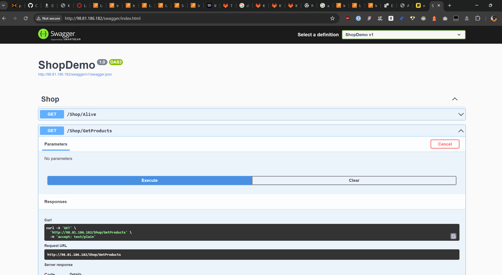
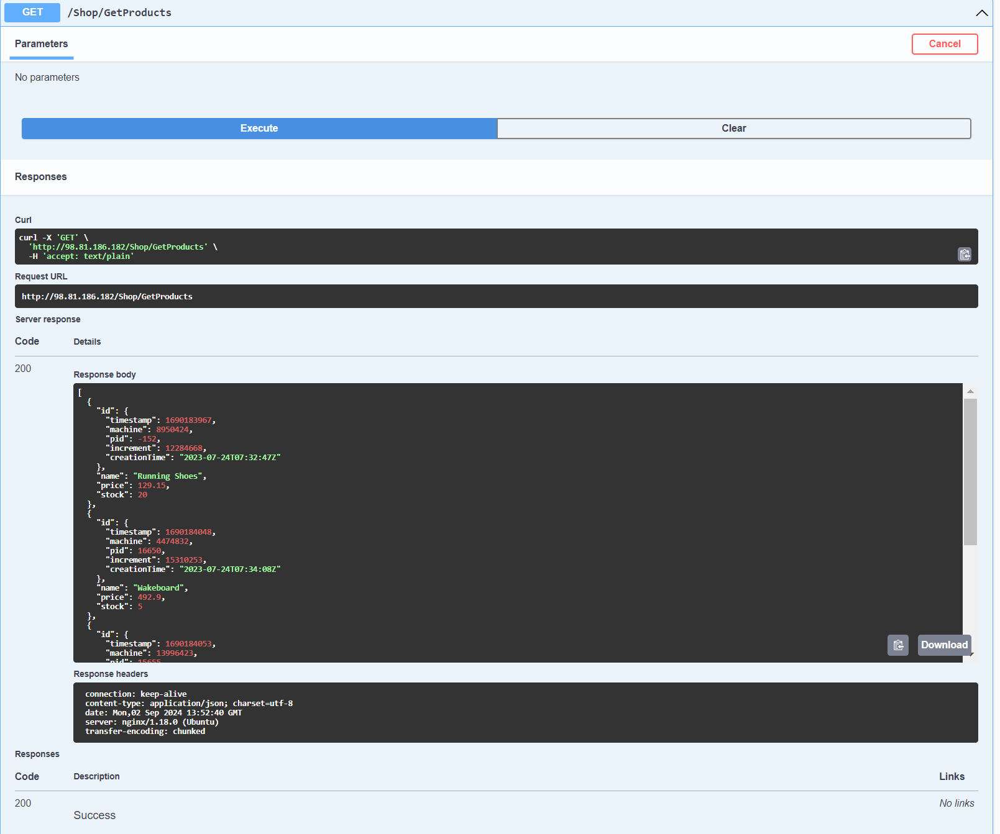
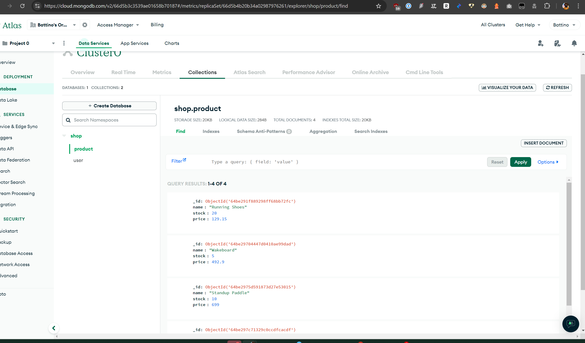
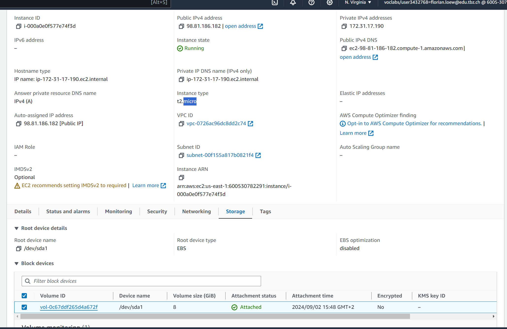
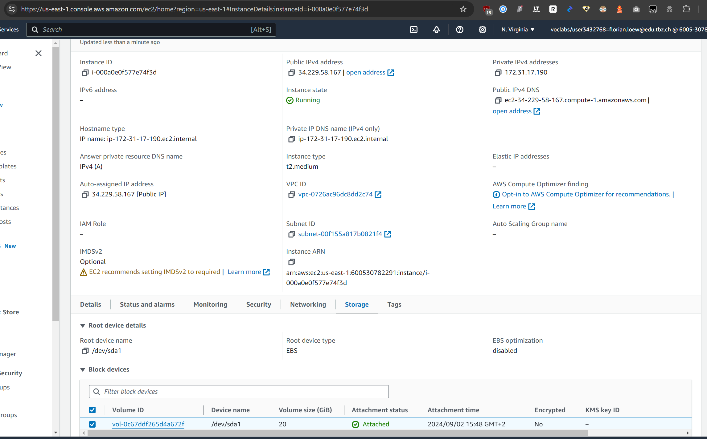

# A

Eine reverse proxy kann ein request der auf den server hineinkommt re rounter. Das heist zu einem anderen port oder zu einer anderen IP.

Swagger Proof:


Swagger Request Success:


MongoDB auszug:


# B
You can increase the size of the Storage device while the VM is running, you can increase the partition in the VM using a unix command.
To upgrade the EC type, you need to shut it down. Then you can modify it, after which you can start it up again.

Before:


After:


# C

Man müsste einen A record erstellen der auf thebalance-1361757032.us-east-1.elb.amazonaws.com zeigt beim DNS registrar.

# D 
Hartekodierte Zugangsdaten:
bash

```yml
- mongosh "mongodb+srv://cluster0.z4iqq.mongodb.net/" --u admin -p 1password < /home/ubuntu/m346scripts/KN06/shop-database-mongodb.txt
- sudo sed -i 's/<username>/admin/g' /home/ubuntu/m346scripts/KN06/dotnet/appsettings.json
- sudo sed -i 's/<password>/1password/g' /home/ubuntu/m346scripts/KN06/dotnet/appsettings.json
```
Die Verwendung von hartekodierten Zugangsdaten ist ein erhebliches Sicherheitsrisiko. Zugangsdaten sollten sicher gespeichert und verwaltet werden, z.B. durch Umgebungsvariablen oder Secrets-Management-Systeme.
