Screenshots:
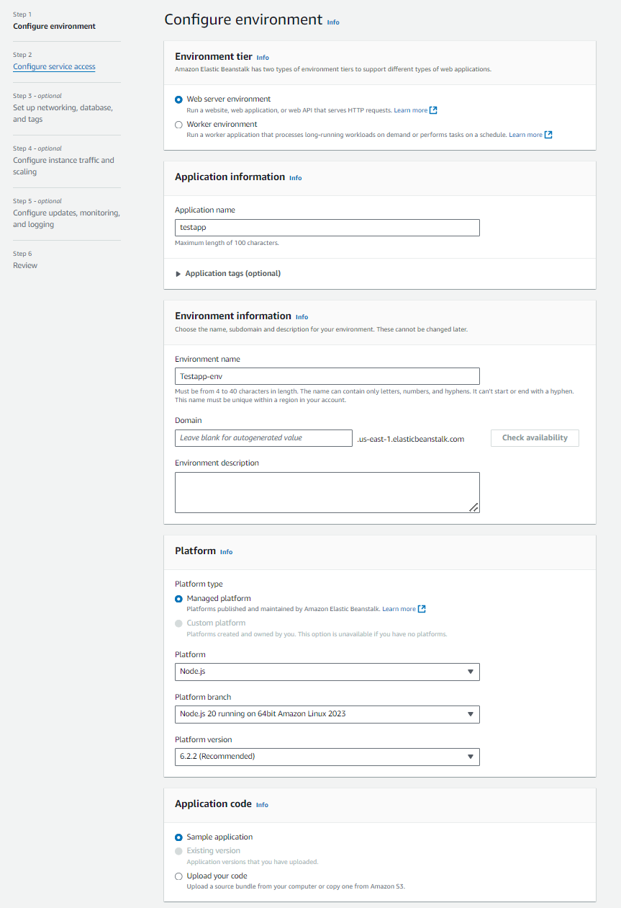
^Hier wurde wenig angepasst auser standart sachen.
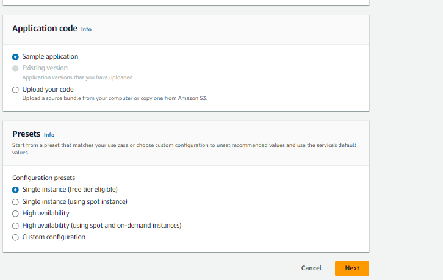
^Hier wurden rollen verwendet^
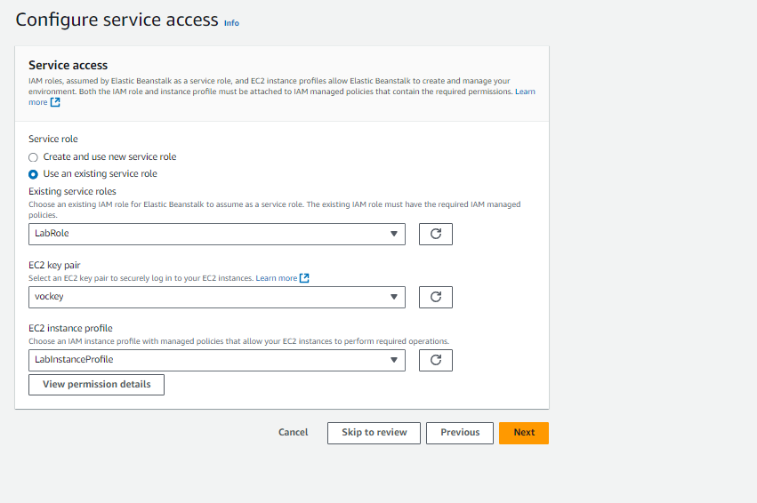
da 
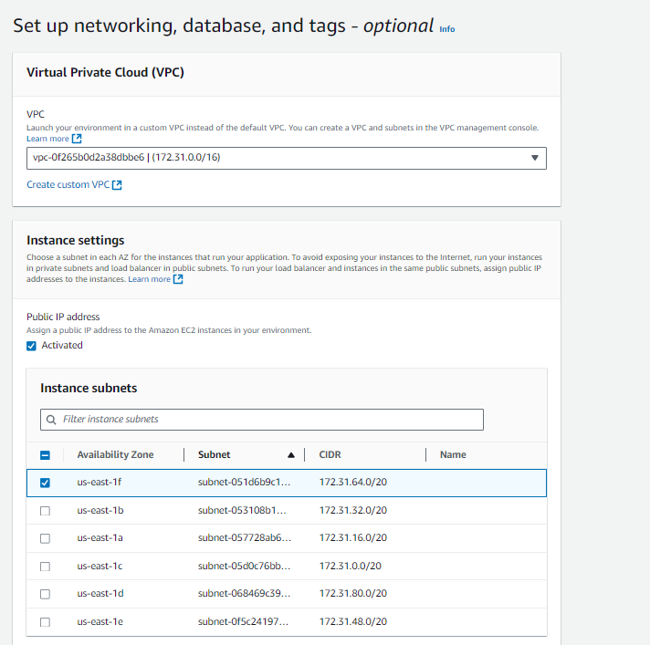
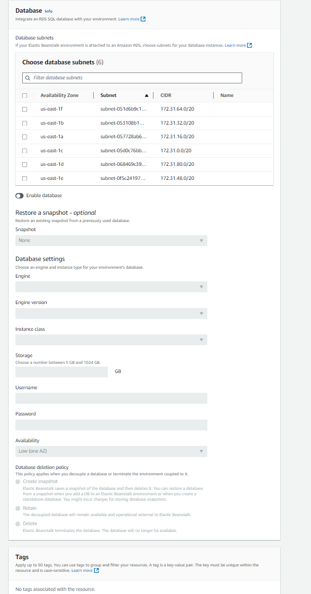
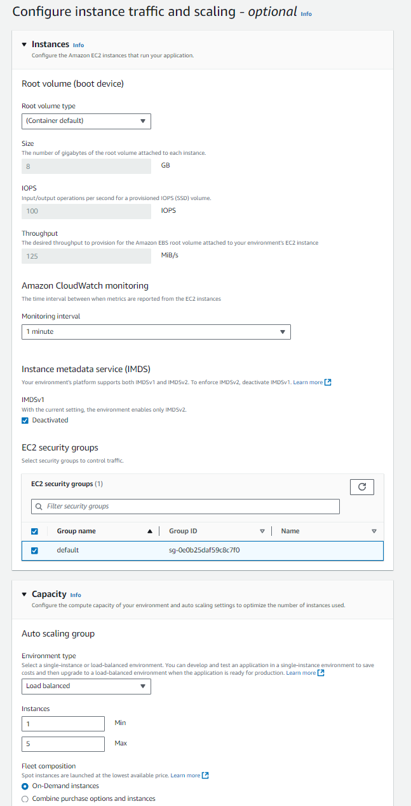
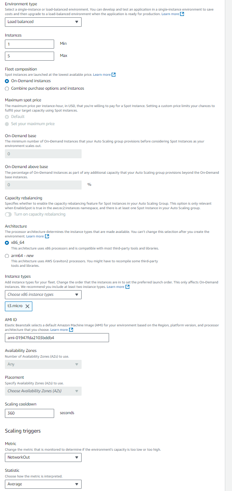
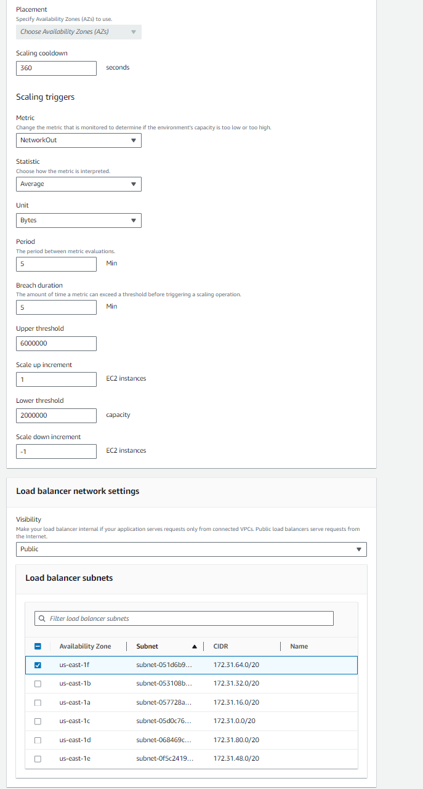
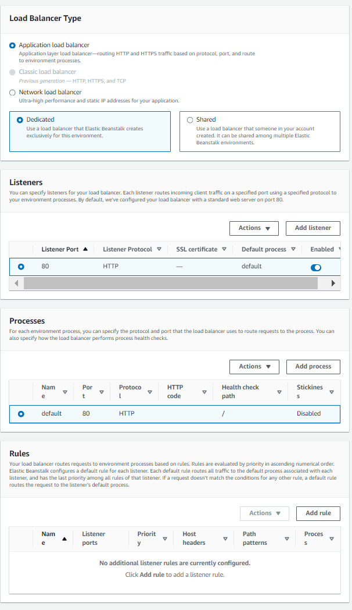
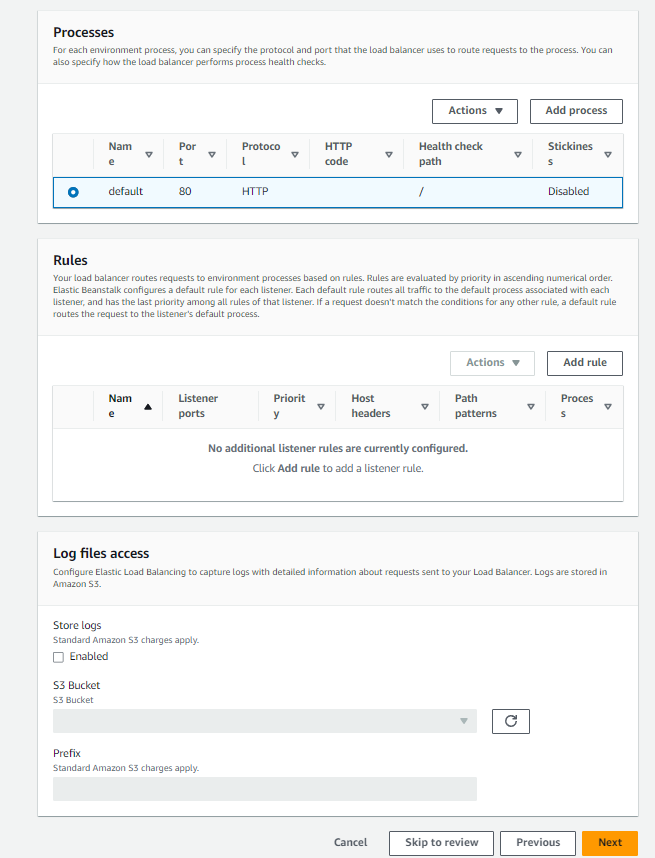
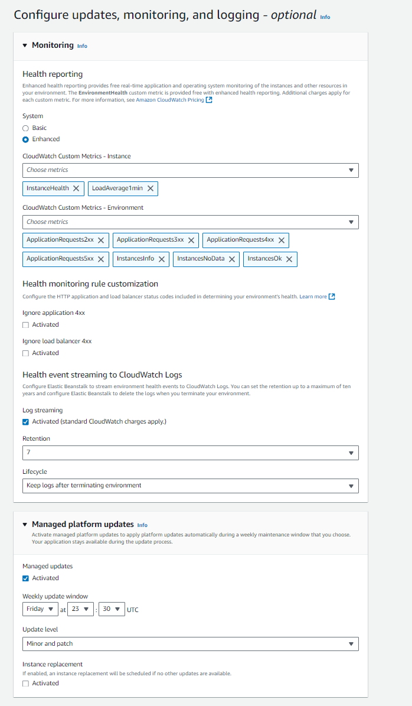
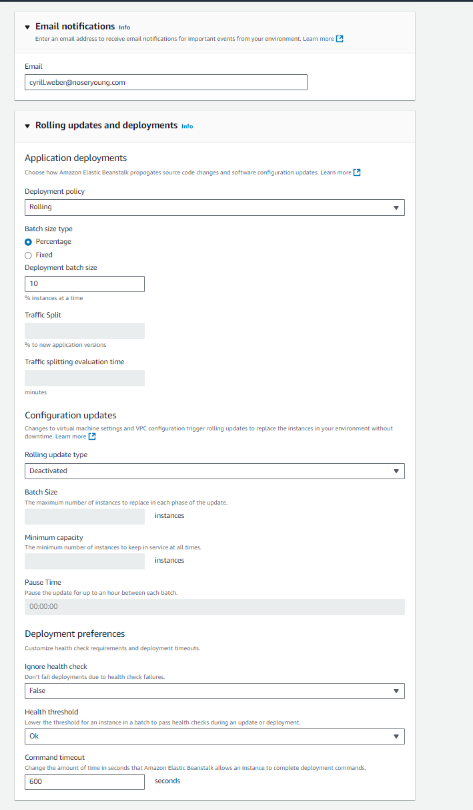
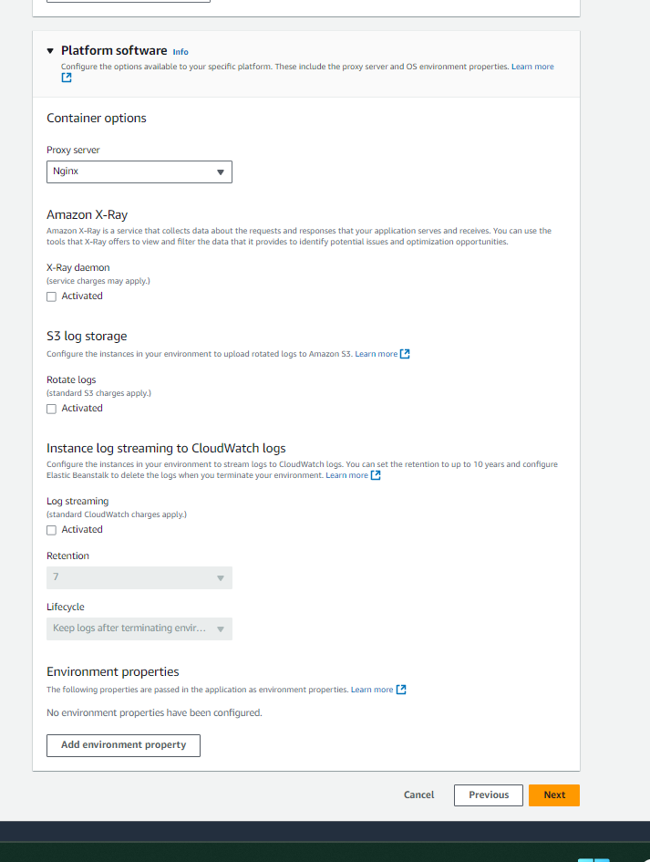

Änderung die ich machen würde wäre ist, 2 subnets aus 2 avalibility zones zu nutzen.

# B 

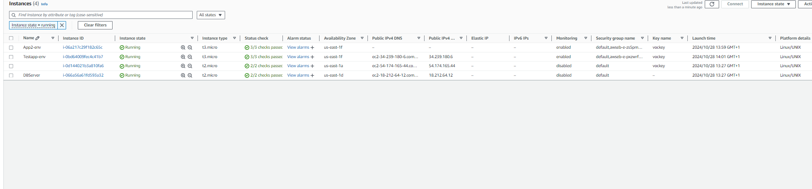
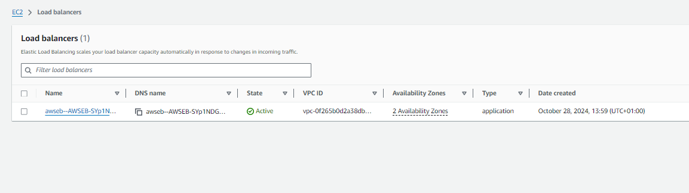

CloudFormation ist ein Dienst von AWS, der zur Infrastrukturverwaltung verwendet wird. Es ermöglicht das Erstellen, Aktualisieren und Löschen von AWS-Ressourcen mithilfe von Templates.

CloudFormation arbeitet auf der Ebene der gesamten Infrastruktur innerhalb von AWS, während Cloud-Init sich auf die Konfiguration einzelner Instanzen konzentriert.

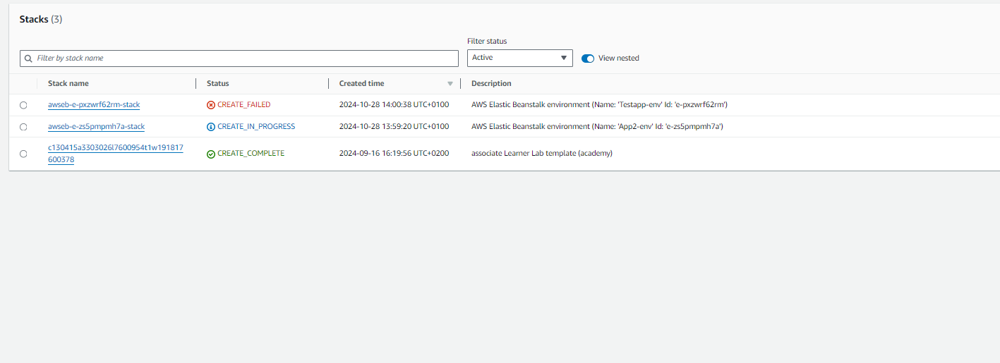
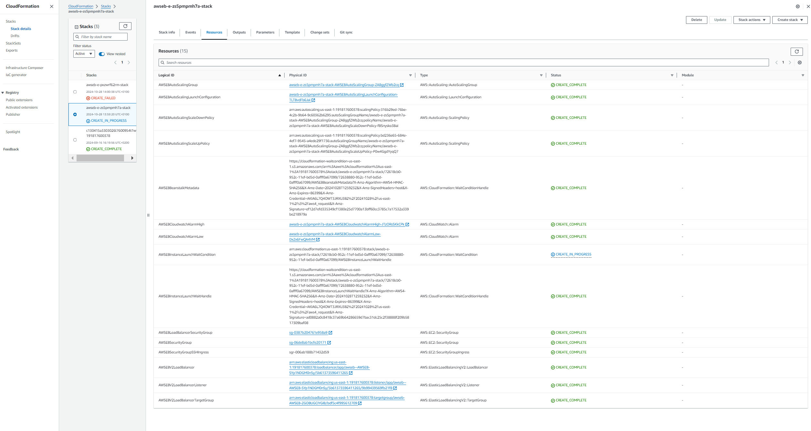
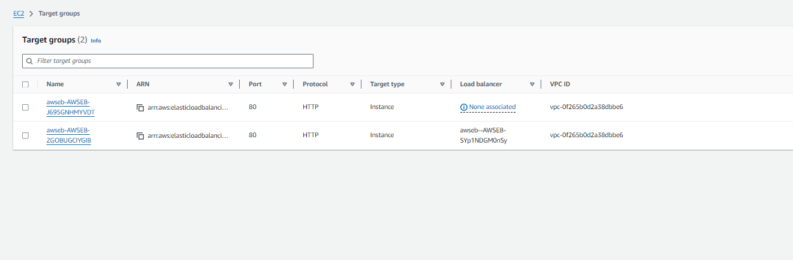
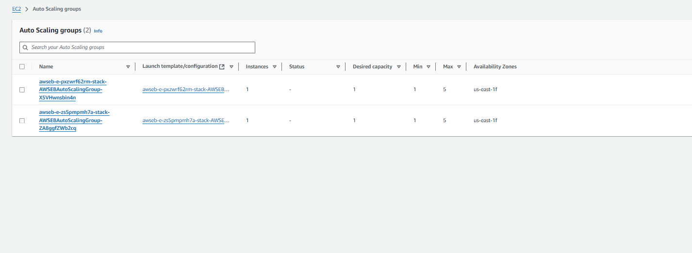
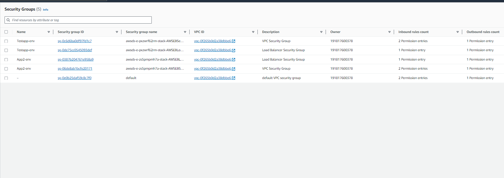