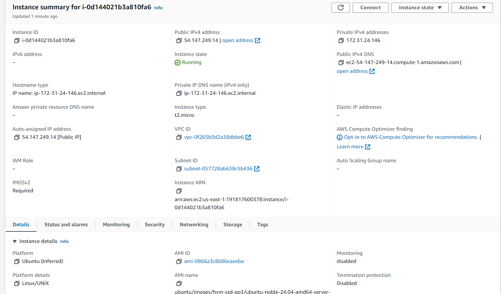
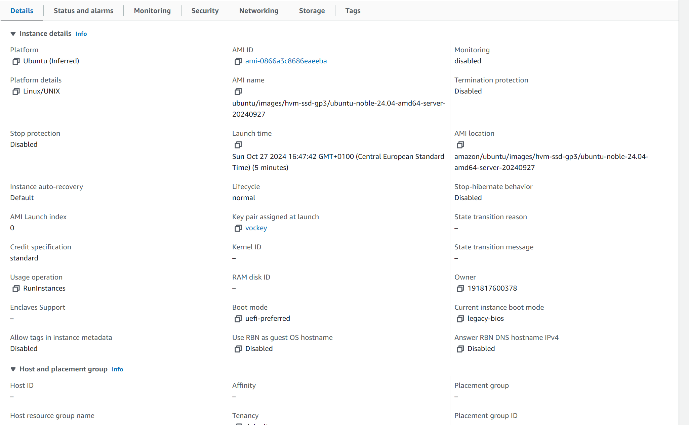
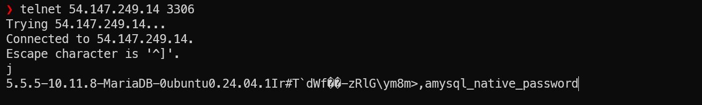
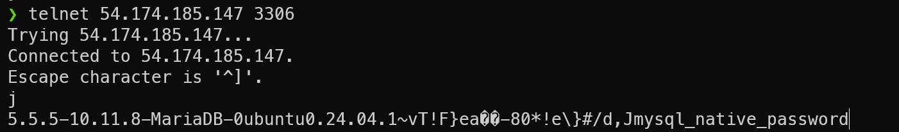

# A
Details der neu erstellten instanz (die gleiche welche ich auf für das starten und stoppen verwendete)



Befehl fürs stoppen
aws ec2 stop-instances --instance-ids i-0540339a81b33474b

Befehl fürs starten:
aws ec2 start-instances --instance-ids i-0540339a81b33474b

Script zur erstellung der instanz:
```
#!/bin/bash

# Variables
INSTANCE_TYPE="t2.micro"
AMI_ID="ami-0866a3c8686eaeeba"
KEY_PAIR_NAME="vockey"
SECURITY_GROUP_IDS="sg-0e0b25daf59c8c7f0"

# CloudInit
user_data=$(cat <<EOF
#cloud-config
users:
  - name: ubuntu
    sudo: ALL=(ALL) NOPASSWD:ALL
    groups: users, admin
    home: /home/ubuntu
    shell: /bin/bash
    ssh_authorized_keys:
      - ssh-rsa AAAAB3NzaC1yc2EAAAADAQABAAABAQCNs6alL8GS2ora3KgLbTkHOaBcsxJMHO9MCuPfHC4W1DejDzfjVD2M61k6afnhNN6HLkkxFMPuxWxleujELK0XxIX97oqasBoBtLOvwpvQlNAmjj5RwyKpaH6JT8DpCrifbdCHkZiGpC3M+lcf960VCcdy+AnTw1CQu0mc53OqasQVVC9+DfAtHq8wqHqnm94BafYmvEof4ZUJmgSC800fsDuV0uclXsQOaHqYF1iE1KNJapHkvj7Ct8p+3uKGWNhr+NORDuikAxAqdin/vd0tkanO0NHbo8PoOogBNpIbTqr4+PRfqIB8dnTsSZ7e9j06JlXSX5X9vXXJnAUBhE3t aws-key
      - ssh-ed25519 AAAAC3NzaC1lZDI1NTE5AAAAID7isuCUjLHzcLtgbCi9gdf+p/urcqTQfhjwvy1+6GE0
      - ssh-rsa AAAAB3NzaC1yc2EAAAADAQABAAABAQC0WGP1EZykEtv5YGC9nMiPFW3U3DmZNzKFO5nEu6uozEHh4jLZzPNHSrfFTuQ2GnRDSt+XbOtTLdcj26+iPNiFoFha42aCIzYjt6V8Z+SQ9pzF4jPPzxwXfDdkEWylgoNnZ+4MG1lNFqa8aO7F62tX0Yj5khjC0Bs7Mb2cHLx1XZaxJV6qSaulDuBbLYe8QUZXkMc7wmob3PM0kflfolR3LE7LResIHWa4j4FL6r5cQmFlDU2BDPpKMFMGUfRSFiUtaWBNXFOWHQBC2+uKmuMPYP4vJC9sBgqMvPN/X2KyemqdMvdKXnCfrzadHuSSJYEzD64Cve5Zl9yVvY4AqyBD lehrer-key
      - ssh-rsa AAAAB3NzaC1yc2EAAAADAQABAAACAQCz/wpWmsCxaQyuNFrIachc/q9nUdByoUcBcicl/wnKLFktKp6du9np9Uhmo4M0tVHNnWCt5uNEi2ks/0XEbg2J+4heuAAKEDr/TVbgabiWGclYKpEWZvmw8gsQwfpAKVG4aS2re7wB2uhw82ZqzJVpGm3ne+sNnz5uVrxN8HUnuR2OWJD6bA9l/fBmE6zdObVXgrCJGjZmVyB5GMeTDJKExgoBpLggZn9CNdu7Sx989xtNLehu6SWM+mGCq9Lcu7usiPG+SuEb8XynYaCOnv8+Oko6SYeJ9Omq/E7Eg6vZHqCbBQ81TIZrGKcikLmF2xP7EOprGOSPVewke7ak7vvmOI+p/RfIAyXj1+GYny+esk9G+qDRFXP9uiIlMfH1oGkQkztvSDMH+EOHqgY66NWQJPj83CaWH/euR0MROHXjm1ar3RuN9qcASAnzCOQQ1FMwFkpIV5x0NDRx0Zp1rLt8ZUFykmIuHZI4g9u6RdAiuWUxx9/eF0fXZa6Ju7GEMKeMtZxJJjmB/WCOylbkT+NPw5RcxgyRLKmUAicnYKXBmULY3pQM/Ui8KiCyJqRbLDBAR+XZYsZ7X5uhcuteu8KIfA2xEbInB4Q3c0DnnSih+GEC4pEbz+NOfeCpLJEn4gfyV1S9S08sG62ls8NPFociA9aWmE1oXfcqwvOkkYhxOw== lehrer-key2
ssh_pwauth: false
disable_root: false
package_update: true
packages:
  - curl
  - wget
  - mariadb-server
runcmd:
  - sudo mysql -sfu root -e "GRANT ALL ON *.* TO 'admin'@'%' IDENTIFIED BY 'password' WITH GRANT OPTION;"
  - sudo sed -i 's/127.0.0.1/0.0.0.0/g' /etc/mysql/mariadb.conf.d/50-server.cnf
  - sudo systemctl restart mariadb.service
EOF
)

# Create the EC2 instance
aws ec2 run-instances \
  --image-id $AMI_ID \
  --instance-type $INSTANCE_TYPE \
  --key-name $KEY_PAIR_NAME \
  --security-group-ids $SECURITY_GROUP_IDS \
  --user-data $(echo "$user_data" | base64 -w 0)
```

Beweis das die instanz funktionert.



# 1. Erstellen eines Subnetztes
aws ec2 create-subnet --vpc-id vpc-12345678 --cidr-block 10.0.1.0/24 --tag-specifications ResourceType=subnet,Tags=[{Key=Name,Value=Subnet-KN05}]

# 2. Erstellen der Sicherheitsgruppe für den Webserver
aws ec2 create-security-group --group-name SG-Webserver --description "Security group for Webserver" --vpc-id vpc-12345678

# 3. Hinzufügen der Inbound-Regel für die Webserver-Sicherheitsgruppe (Port 80 für HTTP-Zugriff)
aws ec2 authorize-security-group-ingress --group-id sg-12345678 --protocol tcp --port 80 --cidr 0.0.0.0/0

# 4. Erstellen der Sicherheitsgruppe für die Datenbank
aws ec2 create-security-group --group-name SG-Database --description "Security group for Database" --vpc-id vpc-12345678

# 5. Hinzufügen der Inbound-Regel für die Datenbank-Sicherheitsgruppe (Port 3306 nur für internes Netzwerk)
aws ec2 authorize-security-group-ingress --group-id sg-87654321 --protocol tcp --port 3306 --cidr 10.0.1.0/24

# 6. Erstellen einer elastischen, öffentlichen IP-Adresse für den Webserver
aws ec2 allocate-address --domain vpc

# 7. Erstellen einer elastischen, öffentlichen IP-Adresse für die Datenbank
aws ec2 allocate-address --domain vpc

# 8. Erstellen eines Netzwerkinterfaces für den Webserver mit der zugeordneten privaten IP
aws ec2 create-network-interface --subnet-id subnet-12345678 --description "Webserver Network Interface" --private-ip-address 10.0.1.10 --groups sg-12345678

# 9. Erstellen eines Netzwerkinterfaces für die Datenbank mit der zugeordneten privaten IP
aws ec2 create-network-interface --subnet-id subnet-12345678 --description "Database Network Interface" --private-ip-address 10.0.1.20 --groups sg-87654321

# 10. Erstellen einer EC2-Instanz für den Webserver und Zuweisen des Netzwerkinterfaces
aws ec2 run-instances --image-id ami-12345678 --count 1 --instance-type t2.micro --network-interface NetworkInterfaceId=eni-12345678 --tag-specifications ResourceType=instance,Tags=[{Key=Name,Value=Webserver-KN05}]

# 11. Erstellen einer EC2-Instanz für die Datenbank und Zuweisen des Netzwerkinterfaces
aws ec2 run-instances --image-id ami-87654321 --count 1 --instance-type t2.micro --network-interface NetworkInterfaceId=eni-87654321 --tag-specifications ResourceType=instance,Tags=[{Key=Name,Value=Database-KN05}]


Ich denke yur Automatisierung mit cli ist ein strukturiertes Skript erforderlich, das die Befehle in korrekter Reihenfolge ausführt und dynamische IDs speichert z.B. in variablen. ich bin jedoch der meinung man sollte lieber ein tool wie Teraform/Opentofu verwenden, welches besser unterhaltbar ist.

# B

Teraform Befhle:
 Initialisieren Sie das Terraform-Projekt
terraform init

 Planen Sie die Änderungen, um sicherzustellen, dass alles korrekt ist
terraform plan

 Wenden Sie die Änderungen an, um die Infrastruktur zu erstellen
terraform apply


Telnet beweis:


Die Teraform konfiguartion ist im main.tf file abgelegt


Terraform ist meiner Meinung nach besser. Es automatisiert die Erstellung und Verwaltung von Infrastrukturressourcen. Mit deklarativer Konfiguration werden Netzwerkeinstellungen und Skripte automatisch angewendet. Das spart manuelle Schritte, die bei anderen Tools, wie mit dem CLI, oft notwendig sind.